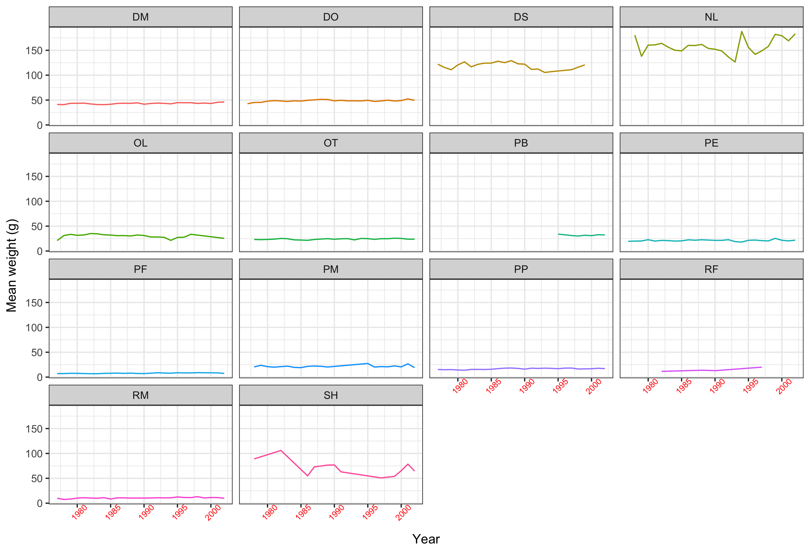

# 2017-08-swc-workshop

A repository created for the Yosemite Software Carpentry Workshop at UC Merced, Aug 17-18, 2017

During the workshop, we played with some modules.  See the official workshop website: [Data Carpentry at UC Merced -  Yosemite](https://snacktavish.github.io/2017-08-17-Yosemite/).

## Introduction

This repository demonstrates **software** and _formats_:

1. **Git**
1. **Github**
1. _Markdown_
1. _Rmarkdown_

## Conclusion

This is a placeholder for my conclusions, which I can't remember now because it's Friday at 4pm.

